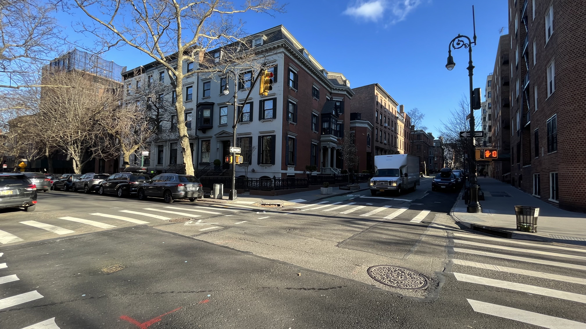
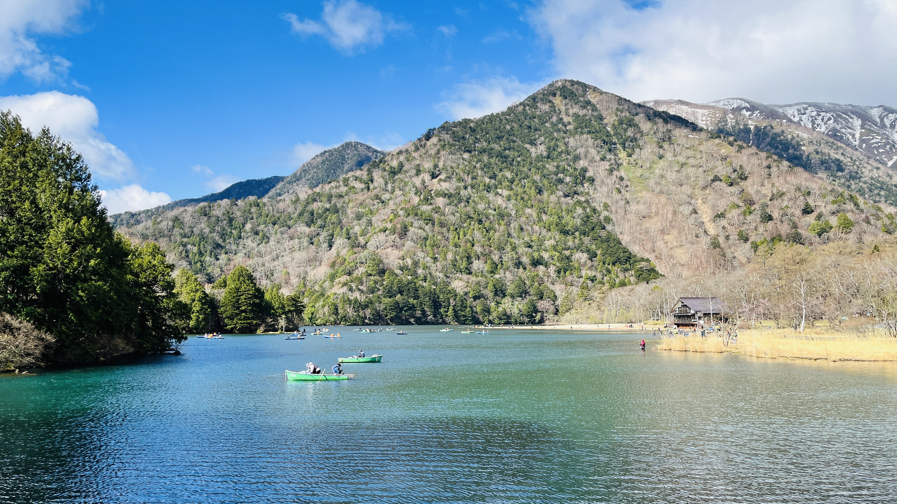
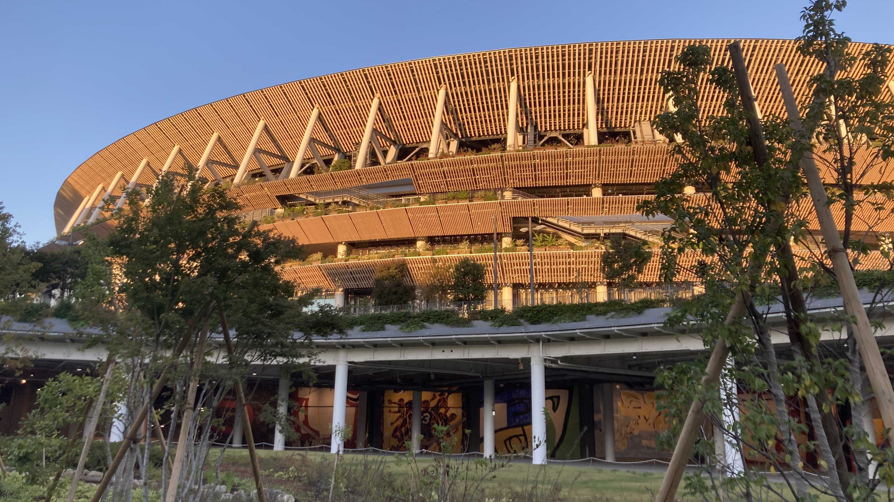
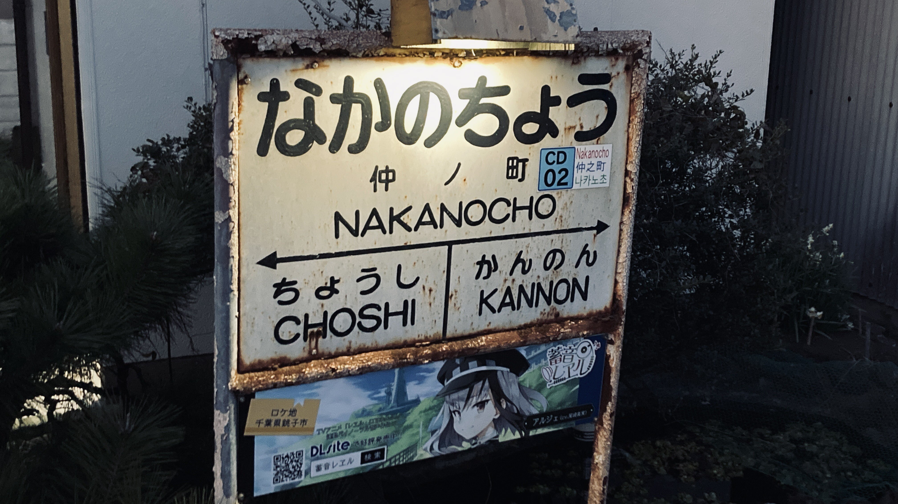
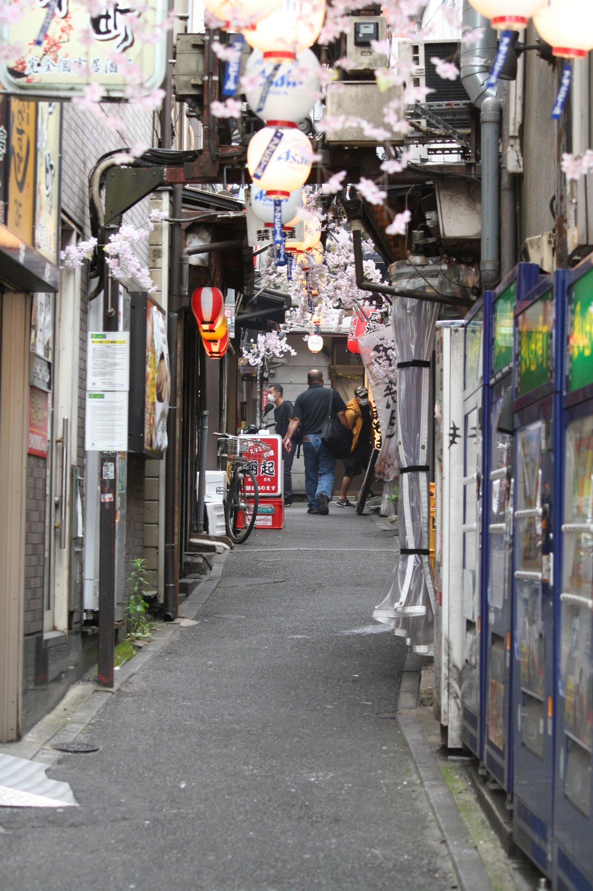

## Welcome to Notebook!

こんにちは。どうも由崎律です！
このサイトは僕が日々思ったことなどを書き散らしてゆくブログサイトです。

## Introducing me

一体僕は何なんでしょうね？自己紹介です！

### Who are you?
僕は由崎律。どこにでもいる高校生です。

コロナ禍1年目のオンライン授業をガン無視してJavaScriptを猛勉強した結果、成績という重い代償を払う代わりにそこそこ役に立つスキルを入手できた、そんなやつです。

### MyData
2006年6月9日生まれ

宮城県仙台市出身

都内の中高一貫男子校に通ってる限界高校生

バックエンド(Node.js)メインのプログラマー

### Contacts

#### Mail
- me@ritsu-me.com
- mail@ritsu-me.com

#### SNS
- Discord
```txt
@ritsu.me
```

- [由崎律 - Facebook](https://www.facebook.com/Ritsu.me)

- [RitsuYuzaki - GitHub](https://github.com/ritsu-me)

- [ゆざきりつ - Twitter](https://twitter.com/ritsu_me)

- [Ritsu_me - Misskey.io](https://misskey.io/@Ritsu_me)

### Hobbys

#### 写真撮影

街歩きをしながら写真を撮るのが好きです。

以下は代表作です。

<sub>*すべての写真は著作権法により一切の二次利用を禁止します。*</sub>












#### 自炊

自炊もできます。最近の目標はソース・エスパニョールを作ることです。